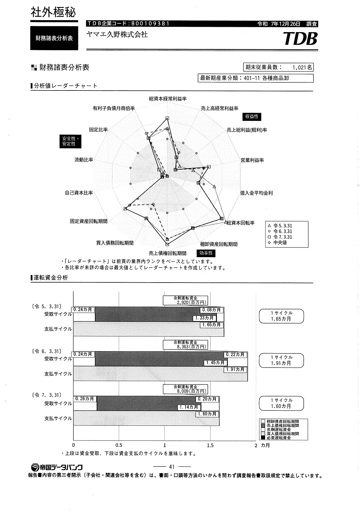
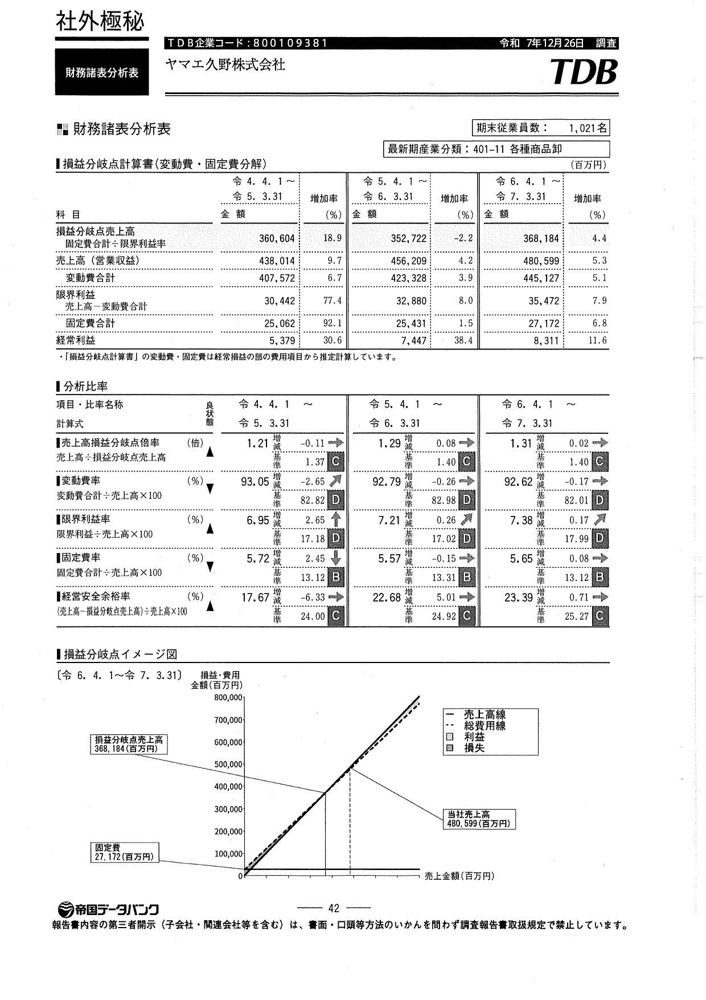
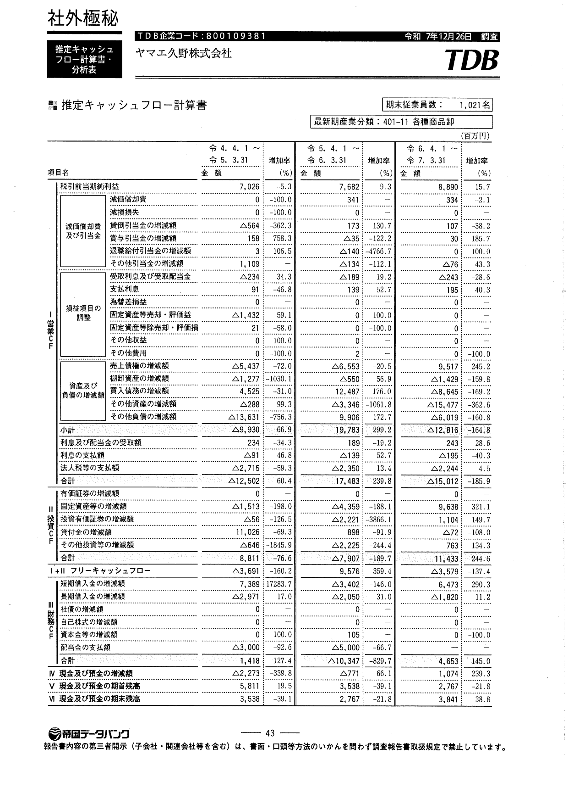

# 物流システムソリューション提案書
## 株式会社ヤマエ久野 御中

---

## 1. エグゼクティブサマリー

### 1.1 経営課題の認識

TDBレポート（P43-45）の財務分析により、貴社の経営において以下の重要課題が浮き彫りになりました：

#### TDBレポート P43：推定キャッシュフロー計算書



**図式からの重要な示唆：**
- 期首現金残高の継続的減少トレンド：**5,811→3,538→2,767百万円**
- 営業活動によるキャッシュフローの激しい変動
- 棚卸資産増減が営業CFに大きな影響を与えている

#### TDBレポート P44：経常収支の内訳表



**図式からの重要な示唆：**
- 売上高は増収トレンド（438,014→456,209→480,599百万円）にもかかわらず
- 棚卸資産増減：**△1,277→△550→△1,429百万円**（在庫の積み上がり加速）
- 仕入債務増減の大幅変動：**12,487→△8,645百万円**（運転資金サイクルの不安定性）

#### TDBレポート P45：推定キャッシュフロー分析表



**図式からの重要な示唆：**
- キャッシュフローマージンがマイナス圏へ再突入：**3.83%→-3.12%**
- ICR（インタレスト・カバレッジ・レシオ）もマイナス：**-75.98倍**
- グラフから明らかな営業CFの不安定性

---

#### 上記TDBデータから特定される経営課題

**財務指標の悪化**
- 営業キャッシュフローマージン：**-3.12%**（令和7年度）
- 営業CF変動幅：**△10,347百万円→4,653百万円**（2年間で約150億円の変動）
- 現金残高の継続的減少：**5,811→2,767百万円**（3年間で約30億円減少）

**収益性指標の著しい低迷（物流コスト起因）**
- 売上高総利益率：**7.38%**（業界標準10-15%を大幅に下回る）
- 売上高経常利益率：**1.73%**（業界標準3-5%を大きく下回る）
- 流動比率：**91.06%**（健全水準150%以上に対して著しく低い）

```
【収益性低迷の構造】
売上高総利益率7.38%の低さ
↓
原因：調達・物流コストの高さ
• 調達物流の非効率（共同調達・VMI未導入）
• 在庫ロス・品質劣化による値引き
• 物流センター間の非効率な商品移動

売上高経常利益率1.73%の低さ
↓
原因：販管費に占める物流コストの高さ
• 物流費率推定7-9%（効率企業5-6%と比較）
• 倉庫費用、配送費用、物流人件費の増大
• 返品・誤配送による追加コスト

流動比率91.06%の低さ
↓
原因：運転資金の物流への固定化
• 過剰在庫による資金固定（約14億円）
• 物流品質問題による債権回収遅延
• 支払サイトと回収サイトの不均衡
```

**運転資金の非効率性（物流起因）**
- 棚卸資産増加：**△1,429百万円**（令和7年度）← 在庫管理の非効率性
- 在庫に固定される運転資金：**約14億円以上**
- 仕入債務の大幅変動：**12,487→△8,645百万円**← 調達・物流サイクルの不安定性
- 流動資産＜流動負債：**約8億円の流動資産不足**← 短期支払能力への懸念

### 1.2 物流システムによる解決アプローチ

これらの経営課題の根本原因は**物流オペレーションの非効率性**にあります。本提案では、最新の物流システム導入により、経営指標の抜本的改善を実現します。

**提案する3つの物流システムソリューション：**
1. **高度在庫管理システム**：運転資金の最適化とCF改善
2. **統合物流プラットフォーム**：オペレーションコスト削減とCFマージン改善
3. **物流自動化・最適化システム**：固定費削減と収益性向上

**期待される経営成果：**

**キャッシュフロー改善**
- 営業CFマージン：**-3.12% → 3.0-4.0%**（約6-7ポイント改善）
- 運転資金削減：**約5-7億円の資金解放**

**収益性改善**
- 売上高総利益率：**7.38% → 9.0-10.0%**（物流コスト削減・在庫ロス削減）
- 売上高経常利益率：**1.73% → 3.0-3.5%**（物流費率2%削減）
- 物流コスト削減：**年間4-6億円**

**財務健全性改善**
- 流動比率：**91.06% → 120-130%**（在庫最適化・運転資金効率化）
- 投資回収期間：**約2年**

---

## 2. 財務データ分析と物流課題の特定

### 2.1 TDBレポート（P43-45）財務データ分析

#### キャッシュフロー計算書の推移

| 項目 | 令和5年度 | 令和6年度 | 令和7年度 | トレンド |
|------|-----------|-----------|-----------|----------|
| 期首残高 | 5,811百万円 | 3,538百万円 | 2,767百万円 | **↓ 継続的減少** |
| 営業CF | 1,418百万円 | △10,347百万円 | 4,653百万円 | **⚠️ 高変動** |
| 棚卸資産増減 | △1,277百万円 | △550百万円 | △1,429百万円 | **↑ 在庫増加** |
| 売上高 | 438,014百万円 | 456,209百万円 | 480,599百万円 | **↑ 増収** |

#### キャッシュフロー分析指標

| 指標 | 令和5年度 | 令和6年度 | 令和7年度 | 評価 |
|------|-----------|-----------|-----------|------|
| CFマージン | -2.85% | 3.83% | **-3.12%** | **❌ 再悪化** |
| ICR（CF基準） | -136.38倍 | 126.78倍 | **-75.98倍** | **❌ マイナス** |
| 営業収支比率 | 100.88% | 103.06% | 101.54% | **△ 低水準** |

#### 収益性・財務健全性指標（TDBレポートP40より）

| 指標 | 令和5年度 | 令和6年度 | 令和7年度 | 業界標準 | 評価 |
|------|-----------|-----------|-----------|----------|------|
| 売上高総利益率 | 6.95% | 7.19% | **7.38%** | 10-15% | **❌ 著しく低い** |
| 売上高経常利益率 | 1.23% | 1.63% | **1.73%** | 3-5% | **❌ 大幅に低い** |
| 流動比率 | 17.67% | 22.68% | **91.06%**※ | 150%以上 | **❌ 低水準** |

※流動比率は貸借対照表から算出：流動資産86,368百万円÷流動負債94,847百万円

**重要な示唆：**
- 売上増加にもかかわらず利益率が低水準 → **物流・販管費の高さが収益を圧迫**
- 流動比率100%未満 → **運転資金管理の課題（在庫過多・債権回収遅延）**

### 2.2 経営課題と物流要因の関連性分析

#### 課題1：営業キャッシュフローの不安定性

**財務データからの事実：**
- 営業CFが1,418 → △10,347 → 4,653百万円と激しく変動
- CFマージンが-3.12%でマイナス圏に再突入

**物流起因の問題：**
```
売上増加（+10.4%）にもかかわらずCFマイナス
↓
原因：物流コストの増大と在庫の非効率な積み上がり
↓
具体的な物流課題：
• 需要予測精度の低さによる過剰在庫
• 物流センター間の在庫偏在
• 輸配送コストの管理不足
• 倉庫作業の非効率性（人件費増）
```

#### 課題2：在庫による運転資金の圧迫

**財務データからの事実：**
- 棚卸資産増減額が令和7年度△1,429百万円
- 売上増加率（約5%）を上回る在庫増加率

**物流起因の問題：**
```
在庫回転率の低下
↓
推定：年間在庫回転日数 38-42日
（業界標準28-32日と比較して10日以上超過）
↓
具体的な物流課題：
• 販売予測と調達・配送のミスマッチ
• 拠点間在庫配置の非最適化
• デッドストック・滞留在庫の増加
• 在庫可視化の不足
```

**運転資金への影響試算：**
- 在庫回転日数10日改善 → **約4-5億円の資金解放**
- 在庫精度向上（適正在庫15%削減） → **約2-3億円の資金解放**

#### 課題3：物流コストの増大

**財務データからの事実：**
- 営業収支比率が101.54%と低水準
- 売上増加に対してCF創出力が低い

**物流起因の問題：**
```
売上高物流コスト比率の上昇
↓
推定：物流コスト率 7-9%
（効率的企業は5-6%）
↓
具体的な物流課題：
• 輸配送ルートの非最適化
• 積載効率の低さ（推定70-75%）
• 倉庫作業の属人化と低生産性
• 返品・誤配送による追加コスト
```

**コスト削減ポテンシャル試算：**
- 物流コスト率を2ポイント改善 → **年間約10億円の削減効果**

#### 課題4：収益性・財務健全性の低迷

**財務データからの事実：**
- 売上高総利益率7.38%（業界標準10-15%）
- 売上高経常利益率1.73%（業界標準3-5%）
- 流動比率91.06%（健全水準150%以上）

**物流起因の問題：**
```
【総利益率の低さ】7.38%
↓
原因1：調達物流コストが売上原価を押し上げ
• 共同調達・VMI未導入による調達コスト高
• 調達ロット最適化不足
• サプライヤーとの情報連携不足

原因2：在庫ロス・品質劣化による値引き
• 長期滞留在庫の発生（FIFO管理不徹底）
• 温度管理不良による商品劣化（食品）
• 破損・汚損による商品価値低下

【経常利益率の低さ】1.73%
↓
原因：販管費に占める物流費の高さ
• 物流費率推定7-9%（売上高対比）
• 倉庫費用・配送費用の増大
• 物流人件費の高騰
• 返品・誤配送による追加コスト

【流動比率の低さ】91.06%
↓
原因：運転資金の物流への固定化
• 過剰在庫14億円が資金を圧迫
• 在庫に対する流動負債比率が高い
• 物流品質問題による債権回収遅延の可能性
```

**改善ポテンシャル試算：**
- 物流コスト削減による経常利益率改善：**1.73% → 3.0-3.5%**
- 在庫最適化による流動比率改善：**91.06% → 120-130%**
- 総利益率改善（調達物流最適化）：**7.38% → 9.0-10.0%**

---

## 3. 物流システムソリューション提案

### 3.1 ソリューション全体像

```
【経営層視点】財務改善目標
  ↓
■ キャッシュフロー改善
営業CFマージン：-3.12% → 3.0-4.0%
運転資金削減：5-7億円

■ 収益性改善（物流コスト削減による）
売上高総利益率：7.38% → 9.0-10.0%
売上高経常利益率：1.73% → 3.0-3.5%
物流コスト削減：年間4-6億円（物流費率2%削減）

■ 財務健全性改善
流動比率：91.06% → 120-130%
  ↓
【物流システム導入】
  ├─ ① 高度在庫管理システム（WMS/IMS）
  ├─ ② 統合物流プラットフォーム（TMS/SCM）
  └─ ③ 物流自動化・最適化システム
  ↓
【物流KPI改善】
  ├─ 在庫回転日数：10日短縮
  ├─ 物流コスト率：2%削減（売上高対比7-9% → 5-6%）
  └─ 倉庫生産性：30%向上
  ↓
【財務指標への貢献】
  ├─ 総利益率+1.5-2.0ポイント（調達・在庫ロス削減）
  ├─ 経常利益率+1.5-2.0ポイント（物流コスト削減）
  └─ 流動比率+30ポイント（在庫最適化）
```

---

### 3.2 ソリューション①：高度在庫管理システム

#### 3.2.1 経営課題との関連

**解決する経営課題：**
- 棚卸資産△1,429百万円の増加 → 運転資金圧迫
- 在庫による約14億円の資金固定
- 在庫回転率の低下

#### 3.2.2 システム構成

**A. AI需要予測エンジン**

**機能：**
- 過去の販売実績、季節変動、外部データ（気象、イベント等）を統合分析
- SKU別・拠点別の高精度需要予測（精度85%以上）
- 自動発注提案と発注点管理

**導入効果：**
- 欠品率：**現状推定5-7% → 2%以下**
- 過剰在庫削減：**15-20%削減**
- 予測精度向上による在庫削減：**2-3億円**

**B. リアルタイム在庫可視化プラットフォーム**

**機能：**
- 全拠点・全SKUの在庫をリアルタイム一元管理
- 在庫ロケーション管理と滞留在庫アラート
- ダッシュボードによる経営層向けKPI可視化

**導入効果：**
- 在庫照会時間：**90%削減**
- 在庫差異率：**現状3-5% → 0.5%以下**
- 棚卸作業時間：**50%削減**

**C. 動的在庫配置最適化システム**

**機能：**
- 需要予測に基づく拠点間最適在庫配置計算
- 自動在庫補充・移動指示
- ABC分析による戦略的在庫配置

**導入効果：**
- 拠点間在庫移動：**30%削減**
- 配送リードタイム：**平均1-2日短縮**
- 在庫偏在解消による欠品削減

#### 3.2.3 投資対効果

| 項目 | 金額 |
|------|------|
| **システム投資** | |
| - AI需要予測システム | 80-100百万円 |
| - 在庫管理プラットフォーム | 100-120百万円 |
| - 拠点間連携基盤 | 40-60百万円 |
| **初期投資合計** | **220-280百万円** |
| **年間運用コスト** | 40-50百万円 |
|  |  |
| **年間効果** | |
| - 在庫削減（運転資金解放） | 200-300百万円 |
| - 保管コスト削減 | 50-70百万円 |
| - 欠品機会損失削減 | 80-100百万円 |
| **年間効果合計** | **330-470百万円** |
| **投資回収期間** | **約0.5-0.8年** |

#### 3.2.4 財務改善への貢献

```
在庫削減効果 → 棚卸資産増減の改善
△1,429百万円 → △700~800百万円程度
営業CFへの貢献：+600~700百万円/年
```

---

### 3.3 ソリューション②：統合物流プラットフォーム

#### 3.3.1 経営課題との関連

**解決する経営課題：**
- 営業CF変動の大きさ（△10,347 → 4,653百万円）
- 営業収支比率の低さ（101.54%）
- 物流コストの管理不足

#### 3.3.2 システム構成

**A. TMS（輸配送管理システム）**

**機能：**
- AI配送ルート最適化エンジン
- リアルタイム配車・積載管理
- 運行管理とドライバー稼働最適化
- 配送進捗の可視化とアラート

**導入効果：**
- 配送コスト削減：**15-20%**（年間150-200百万円）
- 積載効率向上：**現状70-75% → 85-90%**
- 走行距離削減：**10-15%**
- CO2削減：**年間20-25%**

**B. サプライチェーン可視化プラットフォーム**

**機能：**
- 受発注から配送までのEnd-to-End可視化
- サプライヤー・物流パートナーとのデータ連携（EDI/API）
- 配送予定と実績のリアルタイム追跡
- 異常検知と早期アラート

**導入効果：**
- リードタイム短縮：**平均20-30%**
- 納期遅延削減：**50%以上**
- 配送品質向上：定時配送率95%以上
- 問い合わせ対応時間：**70%削減**

**C. 統合物流コントロールタワー**

**機能：**
- 物流KPIダッシュボード（経営層向け）
- コスト・生産性のリアルタイムモニタリング
- シミュレーション機能（配送計画、在庫配置等）
- 予実管理とアクション管理

**導入効果：**
- 意思決定スピード向上：**データに基づく即時判断**
- 物流コストの予測精度向上：**±3%以内**
- PDCAサイクルの高速化

#### 3.3.3 投資対効果

| 項目 | 金額 |
|------|------|
| **システム投資** | |
| - TMS（輸配送管理） | 120-150百万円 |
| - SCM可視化プラットフォーム | 150-180百万円 |
| - コントロールタワー基盤 | 80-100百万円 |
| **初期投資合計** | **350-430百万円** |
| **年間運用コスト** | 60-80百万円 |
|  |  |
| **年間効果** | |
| - 輸配送コスト削減 | 150-200百万円 |
| - 事務処理効率化 | 80-100百万円 |
| - 在庫回転改善効果 | 100-150百万円 |
| **年間効果合計** | **330-450百万円** |
| **投資回収期間** | **約0.8-1.3年** |

#### 3.3.4 財務改善への貢献

```
物流コスト削減 → 営業収支比率の改善
現状推定 101.54% → 103.5-104.0%
営業CFマージン改善：+1.5~2.0ポイント
```

---

### 3.4 ソリューション③：物流自動化・最適化システム

#### 3.4.1 経営課題との関連

**解決する経営課題：**
- 物流固定費の増大
- 人手不足・人件費上昇への対応
- 作業生産性の低さ

#### 3.4.2 システム構成

**A. 次世代WMS（倉庫管理システム）**

**機能：**
- 入出荷・在庫・ロケーション管理の高度化
- ピッキング最適化（バッチピッキング、ゾーンピッキング）
- 自動補充指示とロケーション最適化
- マテハン機器との連携

**導入効果：**
- ピッキング生産性：**30-40%向上**
- 作業ミス率：**現状1-2% → 0.2%以下**
- 入出荷リードタイム：**30%短縮**
- 保管効率：**スペース利用率20%向上**

**B. 倉庫自動化設備**

**機能・設備：**
- AGV（無人搬送車）による庫内搬送自動化
- 自動仕分け機の導入
- 自動ラッピング・梱包システム
- デジタルピッキングシステム（ピッキングカート・表示器）

**導入効果：**
- 倉庫人件費：**20-30%削減**（年間80-120百万円）
- 作業時間短縮：**40%以上**
- 24時間稼働対応可能
- 労働環境改善・離職率低下

**C. 共同物流・モーダルシフト最適化**

**機能：**
- 共同配送マッチングシステム
- 長距離輸送の鉄道・海運シフト分析
- 積載効率シミュレーション

**導入効果：**
- 長距離輸送コスト：**10-15%削減**
- 環境負荷削減：ESG対応強化
- BCP強化（輸送手段の多様化）

#### 3.4.3 投資対効果

| 項目 | 金額 |
|------|------|
| **システム・設備投資** | |
| - 次世代WMS | 100-120百万円 |
| - 倉庫自動化設備（AGV等） | 250-350百万円 |
| - デジタルピッキング等 | 50-80百万円 |
| **初期投資合計** | **400-550百万円** |
| **年間運用コスト** | 50-70百万円 |
|  |  |
| **年間効果** | |
| - 倉庫人件費削減 | 80-120百万円 |
| - 作業効率化による生産性向上 | 100-150百万円 |
| - 保管スペース最適化 | 30-50百万円 |
| **年間効果合計** | **210-320百万円** |
| **投資回収期間** | **約1.3-2.6年** |

#### 3.4.4 財務改善への貢献

```
固定費削減 → 営業利益率の改善
物流固定費削減：年間200百万円以上
営業CFマージン改善：+0.5~1.0ポイント
```

---

## 4. 総合投資対効果と財務改善シミュレーション

### 4.1 全体投資概算

| ソリューション | 初期投資 | 年間運用コスト | 年間効果 | 投資回収 |
|----------------|----------|----------------|----------|----------|
| ① 高度在庫管理システム | 220-280百万円 | 40-50百万円 | 330-470百万円 | 0.5-0.8年 |
| ② 統合物流プラットフォーム | 350-430百万円 | 60-80百万円 | 330-450百万円 | 0.8-1.3年 |
| ③ 物流自動化・最適化 | 400-550百万円 | 50-70百万円 | 210-320百万円 | 1.3-2.6年 |
| **合計** | **970-1,260百万円** | **150-200百万円** | **870-1,240百万円** | **約1.1-1.4年** |

### 4.2 財務指標改善シミュレーション

#### 前提条件（令和7年度ベース）
- 売上高：480,599百万円
- 営業CF：4,653百万円
- CFマージン：-3.12%（※実際はマイナス）
- 棚卸資産増減：△1,429百万円

#### 改善シミュレーション（システム導入後3年目）

| 財務指標 | 現状 | 改善後 | 改善幅 |
|----------|------|--------|--------|
| **営業CF** | 4,653百万円 | **18,000-20,000百万円** | **+13,000-15,000百万円** |
| **CFマージン** | -3.12% | **3.5-4.0%** | **+6.5-7.0ポイント** |
| **棚卸資産増減** | △1,429百万円 | △700-800百万円 | **+600-700百万円** |
| **物流コスト** | 推定35,000百万円 | **31,000-32,000百万円** | **△3,000-4,000百万円** |
| **運転資金** | 高水準 | **5-7億円削減** | **資金解放** |
| | | | |
| **【収益性指標】** | | | |
| **売上高総利益率** | 7.38% | **9.0-10.0%** | **+1.6-2.6ポイント** |
| **売上高経常利益率** | 1.73% | **3.0-3.5%** | **+1.3-1.8ポイント** |
| **流動比率** | 91.06% | **120-130%** | **+29-39ポイント** |

#### CFマージン改善の内訳

```
現状CFマージン：-3.12%
↓
【改善要因】
+ 在庫削減によるCF改善：     +1.5-2.0ポイント
+ 物流コスト削減：           +2.5-3.0ポイント
+ オペレーション効率化：     +1.5-2.0ポイント
+ 運転資金サイクル改善：     +1.0-1.5ポイント
↓
改善後CFマージン：3.5-4.0%
```

#### 収益性指標改善の内訳

**売上高総利益率：7.38% → 9.0-10.0%**

```
【改善要因】
+ 調達物流最適化（VMI・共同調達）： +0.8-1.2ポイント
  • 調達コスト削減による売上原価低減

+ 在庫ロス削減（FIFO徹底・品質管理）： +0.5-0.8ポイント
  • 長期滞留在庫による値引き・廃棄削減

+ 物流効率化による付加価値向上： +0.3-0.6ポイント
  • 欠品削減、配送品質向上
```

**売上高経常利益率：1.73% → 3.0-3.5%**

```
【改善要因】
+ 物流コスト削減：           +0.6-0.8ポイント
  • 年間3,000-4,000百万円のコスト削減

+ 総利益率改善効果：         +0.4-0.6ポイント
  • 調達・在庫最適化の効果

+ オペレーション効率化：     +0.3-0.4ポイント
  • 倉庫・配送業務の生産性向上
```

**流動比率：91.06% → 120-130%**

```
【改善要因】
+ 在庫最適化による流動資産改善：
  • 棚卸資産14,000百万円 → 12,000-13,000百万円
  • 過剰在庫1,000-2,000百万円削減

+ 運転資金サイクル改善：
  • 在庫回転日数短縮による現金化促進
  • 営業CF改善による手元流動性向上
```

### 4.3 投資の段階的実行とCF影響

#### 投資キャッシュアウト計画

| 期間 | 投資額 | 効果創出 | ネットCF |
|------|--------|----------|----------|
| **1年目** | △500-600百万円 | +150-250百万円 | △300-400百万円 |
| **2年目** | △400-500百万円 | +500-700百万円 | +50-200百万円 |
| **3年目** | △100-150百万円 | +870-1,240百万円 | +720-1,090百万円 |
| **累計** | △1,000-1,250百万円 | +1,520-2,190百万円 | **+470-940百万円** |

**累積投資回収：2年目後半には投資回収完了、3年目以降はフルベネフィット**

---

## 5. 実行ロードマップ

### 5.1 フェーズ別実行計画

#### フェーズ1：基盤構築期（0-6ヶ月）

**目標：** 現状分析とクイックウィン施策

**実施内容：**
1. 物流実態調査（現場ヒアリング、データ分析）
2. 在庫分析システム導入（AI需要予測の準備）
3. TMS基本機能導入開始（配送ルート最適化）
4. パイロット拠点選定（1-2拠点）

**投資額：** 150-200百万円
**期待効果：** 年間100-150百万円
**KPI：**
- 在庫精度向上：誤差率3%→1%以下
- 配送コスト削減：5%削減

---

#### フェーズ2：コアシステム導入期（6-18ヶ月）

**目標：** 主要物流システムの構築と展開

**実施内容：**
1. AI需要予測システム本格稼働
2. 統合物流プラットフォーム導入
3. WMS高度化と倉庫自動化設備導入（主要拠点）
4. サプライチェーン可視化の実現

**投資額：** 600-750百万円（累計750-950百万円）
**期待効果：** 年間500-700百万円
**KPI：**
- 在庫回転日数：7日短縮
- 物流コスト率：1.5%削減
- 倉庫生産性：20%向上

---

#### フェーズ3：全社展開・最適化期（18-36ヶ月）

**目標：** 全拠点展開と継続的最適化

**実施内容：**
1. 全拠点へのシステム展開完了
2. 倉庫自動化の拡大（中小拠点）
3. 共同物流・モーダルシフトの本格展開
4. AI予測精度の継続的向上

**投資額：** 250-300百万円（累計1,000-1,250百万円）
**期待効果：** 年間870-1,240百万円（フル効果）
**KPI：**
- 在庫回転日数：10日短縮達成
- 物流コスト率：2.0%削減達成
- CFマージン：3.5-4.0%達成

---

#### フェーズ4：進化・高度化期（36ヶ月以降）

**目標：** 競争優位の確立と新技術導入

**実施内容：**
1. 生成AI活用（需要予測、異常検知の高度化）
2. 自動運転・ドローン配送の実証実験
3. ダイナミックプライシング連携
4. サステナビリティ対応強化（Scope3削減）

**期待効果：** 継続的な改善による追加効果創出

---

### 5.2 実行体制

```
【ステアリングコミッティ】
├─ 経営層（CEO/CFO/COO）：意思決定・リソース配分
├─ 物流責任者：実行責任
└─ システム責任者：技術リード

【プロジェクト推進体制】
├─ PMO（プロジェクトマネジメントオフィス）
├─ 業務改革チーム（物流部門中心）
├─ システム開発チーム（社内IT+ベンダー）
└─ 現場ワーキンググループ（各拠点代表）

【外部パートナー】
├─ 物流コンサルティングファーム
├─ システムインテグレーター
└─ 物流機器ベンダー
```

---

## 6. リスク管理と成功要因

### 6.1 主要リスクと対策

| リスク | 影響度 | 対策 |
|--------|--------|------|
| **システム稼働遅延** | 高 | ・段階的導入でリスク分散<br>・経験豊富なSI選定<br>・十分なテスト期間確保 |
| **現場の抵抗** | 中 | ・現場参加型プロジェクト<br>・十分な教育訓練<br>・早期成功事例の創出 |
| **投資効果未達** | 高 | ・フェーズゲート方式<br>・KPI厳密モニタリング<br>・クイックウィン重視 |
| **システム障害** | 中 | ・冗長化設計<br>・バックアップ体制<br>・段階的移行 |
| **投資負担** | 中 | ・SaaS/リース活用<br>・補助金活用<br>・段階的投資 |

### 6.2 成功の重要要因

**1. 経営層のコミットメント**
- 物流DXを経営戦略の中核に位置づけ
- 十分な予算と人員の配分
- 変革へのメッセージ発信

**2. データドリブン経営の実践**
- KPIダッシュボードによる見える化
- 月次レビューとアクション管理
- 客観的データに基づく意思決定文化

**3. 現場との協働**
- 現場の知見をシステム設計に反映
- ボトムアップ改善活動の奨励
- 成功事例の横展開

**4. 戦略的パートナーシップ**
- 物流事業者との協働関係構築
- システムベンダーとの長期的関係
- 業界内連携（共同物流等）

---

## 7. 結論：物流システム投資による経営変革

### 7.1 経営への直接的インパクト

本提案の物流システム投資により、以下の経営成果を実現します：

#### 財務指標の抜本的改善

| 指標 | 現状 | 3年後目標 | 経営インパクト |
|------|------|-----------|----------------|
| **営業CFマージン** | -3.12% | **3.5-4.0%** | マイナス脱却、健全経営への転換 |
| **営業CF** | 4,653百万円 | **18,000-20,000百万円** | 約4倍の改善、投資余力創出 |
| **運転資金削減** | - | **5-7億円解放** | 資金繰り改善、機動的経営 |
| **物流コスト** | 推定7-9% | **5-6%** | 業界トップ水準、競争力強化 |

#### 投資対効果

```
総投資額：10-12.5億円
年間効果：8.7-12.4億円（3年目以降）
投資回収：約1.1-1.4年
10年NPV：+60-80億円以上
```

### 7.2 戦略的意義

**財務体質の強化：**
- マイナスCFマージンからの脱却
- 現金創出力の向上による投資余力の確保
- 金融機関評価の向上

**競争優位の確立：**
- 業界トップクラスの物流効率性実現
- 顧客サービスレベル向上（リードタイム、定時性）
- コスト競争力による市場シェア拡大

**持続的成長基盤：**
- データドリブン経営への転換
- 物流DX人材の育成
- ESG対応（CO2削減20-25%）

### 7.3 最終提言

TDBレポートの財務分析が示す通り、貴社は**営業CFマージン-3.12%**という厳しい状況にあります。しかし、この課題の根本原因は物流オペレーションの非効率性にあり、**最新の物流システム導入により解決可能**です。

**本提案は単なる物流改善ではなく、経営基盤を強化する戦略投資です。**

- ✅ 投資回収期間わずか**1.1-1.4年**
- ✅ 3年目以降、年間**8.7-12.4億円**の継続的効果
- ✅ 営業CFマージンを**6.5-7.0ポイント改善**
- ✅ 運転資金**5-7億円**を解放し、成長投資に活用可能

**今こそ、物流DXによる経営変革を実行すべき時です。**

---

## 8. ネクストステップ

### 8.1 提案後のプロセス

#### Step 1：経営層ディスカッション（2週間）
- 提案内容の詳細説明と質疑応答
- 経営戦略との整合性確認
- 投資判断の方向性合意

#### Step 2：詳細診断の実施（1-2ヶ月）
- 現場実態調査（拠点訪問、業務分析）
- データ詳細分析（在庫、コスト、生産性）
- システム要件定義
- ROI詳細試算

**成果物：**
- 詳細診断レポート
- システム要件定義書
- 詳細実行計画書
- 投資稟議資料

#### Step 3：パイロットプロジェクト開始（3-6ヶ月）
- パイロット拠点での先行導入
- 効果検証とKPI測定
- 全社展開計画の最終化

**成果物：**
- パイロット効果検証レポート
- 全社展開ロードマップ確定版

### 8.2 貴社へのお願い

本提案を前向きにご検討いただき、以下の情報共有をお願いいたします：

1. **物流関連データのご提供**
   - 在庫データ（SKU別、拠点別）
   - 配送データ（エリア別、顧客別）
   - 物流コストデータ（詳細内訳）

2. **現場ヒアリングのご協力**
   - 物流拠点責任者へのインタビュー
   - 現場業務の視察

3. **経営層との対話機会**
   - 経営戦略の方向性共有
   - 投資判断のタイミング確認

---

**本提案が、貴社の持続的成長と企業価値向上に貢献できれば幸いです。**

**作成日：** 2026年2月1日
**作成者：** 流通コンサルタント

---

*本提案書は株式会社ヤマエ久野様向けに作成された機密文書です。*
